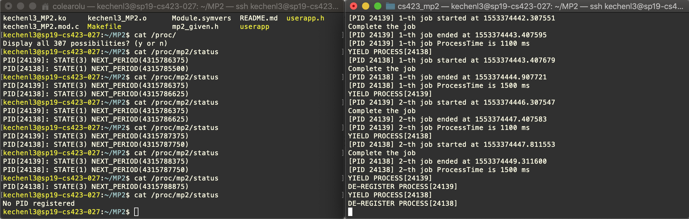

# cs423_mp2
CS423 Machine Problem 2 - RM Scheduler

# Introduce

This the README document of the CS423 MP2, writen by Kechen Lu (kechenl3), is for introducing How-to and the basic implementation ideas of this machine problem.

This module is compiled in the Linux Kernel v4.4 which is running over the VM the MP0 has done that. Basically, this module runs for scheduling the running processes registered according to the Rate Monotonic Scheduling algorithm, and each time we have the highest priority (the one with shortest period if the ) task to run. For each job of each process, we should not miss each deadline and thus have the addmission control to 

And during the running process, it could read from the proc file to get all registered processes and its scheduling states. This module used the proc/ filesystem, the kernel timer, kthread and kernle sched APIs.

# Module Design

## Summary

This MP2 we are going to create a new Rate Monotonic scheduler, which leverages the **Linux Scheduler API** to do the context switch and **kthread** to implement the dispatching thread that is responsible for the look up of highest priority task. Stillly, we remain using the **Proc** file system to initiate user commands ***REGISTRATION/YIELD/DE-REGISTRATION***. Additionally, we made the new customized task struct mp2_task_struct to be the scheduling list element. So the high level architecture of the mp2 is like below.

## Design Decisions in the Implementation

### Customized Task Struct

We have the task struct like below. So the linux_task is the actual PCB, the kernel thread structure which we could get it in the given helper function *find_task_by_pid*. The wakeup_timer is for the periodic tasks timing out in the certain period, to let the certain task state to be READY. The rb stores the period, computation time and the PID which is essential to denote a process. Then we have the state to denote the current state of this task, which has three - RUNNING, READY and SLEEPING. Besides, the next_release is the 

```c
// Define the customized task struct
struct mp2_task_struct {
    struct task_struct* linux_task;
    struct timer_list wakeup_timer;
    struct registration_block rb;
    struct list_head next;

#define RUNNING  0x01
#define READY    0x02
#define SLEEPING 0x03
    unsigned int state;
    uint64_t next_release;
};
```

### Proc File System

Like we implement in the MP1, we have to implement the read and write callbacks for the proc file we have in */proc/mp2/status*. 

For the read callback, we iterate through the registration task list, print out the info of the task in the format "PID[%u]: STATE(%u) NEXT_PERIOD(%llu)\n". 

For the write callback, we first need to parse the user's command. There are three commands in the format like below.

```
REGISTRATION - R,PID,PERIOD,COMPUTATION TIME

YIELD - Y,PID

DE-REGISTRATION - D,PID
```

Through parsing the string using the comma as the delimeter, we can get the certain field and convert the str to long or int using the helper function like *kstrtoul()*. If there are no matched command input or invalid arguments, we return error and not to have next steps.

### Admission control 

We need to assure that the sum of all tasks' rate of computation time over period is less than the 0.693. Since now we cannot use Floating Point, so we have the rate computing formula looks like this computation_time * 1000 / period. As a consequence, we asssume the rate accuracy is 0.001. And each time we register a new task, we add this taks's rate to the global rate_sum, and if the rate_sum is larger than the 693, registration failed. The code is like below.

```c
// Admission control check if the rate sum is larger than the 
// admission control rate constraints
static bool admission_control(unsigned long period, unsigned long c_period) {
    unsigned long rate = c_period * 1000 / period;
    if (rate + rate_sum <= AC_RATE) {
	rate_sum += rate;
	return true;
    } else {
	return false;
    }
}
```

### Registration

In the REGISTRATION, we allocate the new memory area for the mp2_task_struct, using the speciifc kernel subsystem - **slab cache**, to have a better performance when frequently allocate and deallocate since we have the cache to map the cache area to the certain memory space. And we initialize/setup the timer here and initilize the timer's current next_release to the jiffies but we do not modify the next timeout for the timer. At this time, the task state is SLEEPING.

### De-registration

In the DE-REGISTRATION, we release the related resource of the mp2_task_struct. We want to delete the timer and free the corresponding kernel memory and slab cache. In addtion to that, we have the current task to be NULL and minus this task's rate from the global variable rate_sum. 

### Yield

When the user application calls the Y,PID, we want to let this task to be SLEEPING and using the `set_task_state(cur->linux_task, TASK_UNINTERRUPTIBLE)` . If the current jiffies is less than the next_release, we can modify the timer timeout to the next period. Then we want to wake up the dispatching thread, and then call the schedule() to have the dispatching thread running immediately. 

### Timer Handler

We passing the pointer of current task of this timer, through the timer handler's argument, the unsigned long data. We set the task state = READY, and then wake up the dispatching thread.

### Dispatcher and Scheduling 

One of the most important part is the dispaching thread - ***Dispatcher*** and the scheduling algorithm implementation of RM scheduler. In the dispatching thread looping, we do the things like psedocode below.

```c
int dispatching_thread() {
  while(!kthread_should_stop()){
    if we have the current task and its state is RUNNING {
      current task state = READY;
      current task priority = lowest;
    }
    
    Iterate the task list to find the task with largest rate = computation time / period;
    if we found the highest_priority_task {
      highest_priority_task state = RUNNING;
      highest_priority_task priority = highest;
      currrent task = highest_priority_task;
      wake up the highest_priority_task;
    }
    
    sleeping;
    schedule(); // trigger context switch
  }
}
```

### Lock

In this MP, we decide to use the spin lock `spin_lock_t` , since the normal mutex locking would trigger schedule() if the other thread has held the lock. And when we use the `spin_lock_irqsave(&sl, flags)` and `spin_unlock_irqrestore(&sl, flags)` to do the lock and unlock because that could be held in the interrupt context.

### User Application

In the user application, we have the user input the arguement through the command line arguments. So when we want to run the user application, the command line is like this, we input three arguments, period, computation time and the number of jobs.

```bash
./userapp [period] [computation time] [number of jobs]
```

And then we follow the application model to do the interaction with the mp2 kernel module we write. We use the sscanf(), to parse and get the read information from the proc file /proc/mp2/status. 

We use the factorial computation to emulate the doing job, and use the clock() to make sure the job is running exactly in the given computation time with the CPU control. But we use the gettimeofday() to get the real clock running time to accurately denote the processing time even being preempted.  

# How-to

## How-to Compile

```bash
$ make all
```

Running make all to compile the user app and kernel modules.

## How-to Install

```bash
$ sudo insmod kechenl3_MP2.ko
```

After installing the module, we will see the log through dmesg, implying the module has been loaded. 

```bash
$ dmesg
[  229.829534] MP2 MODULE LOADING
[  229.830191] MP2 MODULE LOADED
```

## How-to Run

We can use the user app to test the scheduler kernel module working correctly. By running the cmd below to concurrentlly run the user application. Below is the example to run the userapp with period 4000 ms and processing time is 1000 ms with number of jobs is 8 times.

```bash
./userapp [period] [computation time] [number of jobs]

kechenl3@sp19-cs423-027:~/MP2$ ./userapp 4000 1000 8
REGISTER PROCESS[22133]
PID[22133]: STATE(3) NEXT_PERIOD(4315259473)
22133 3 4315259473
[PID 22133] Jobs started at 1553372334.699168
YIELD PROCESS[22133]
[PID 22133] 0-th job started at 1553372338.707573
Complete the job
[PID 22133] 0-th job ended at 1553372339.707631
[PID 22133] 0-th job ProcessTime is 1000 ms
YIELD PROCESS[22133]
[PID 22133] 1-th job started at 1553372342.699560
Complete the job
[PID 22133] 1-th job ended at 1553372343.699604
[PID 22133] 1-th job ProcessTime is 1000 ms
YIELD PROCESS[22133]
[PID 22133] 2-th job started at 1553372346.699550
Complete the job
[PID 22133] 2-th job ended at 1553372347.699584
[PID 22133] 2-th job ProcessTime is 1000 ms
YIELD PROCESS[22133]
[PID 22133] 3-th job started at 1553372350.699561
Complete the job
[PID 22133] 3-th job ended at 1553372351.699602
[PID 22133] 3-th job ProcessTime is 1000 ms
YIELD PROCESS[22133]
[PID 22133] 4-th job started at 1553372354.699748
Complete the job
[PID 22133] 4-th job ended at 1553372355.699783
[PID 22133] 4-th job ProcessTime is 1000 ms
YIELD PROCESS[22133]
[PID 22133] 5-th job started at 1553372358.699556
Complete the job
[PID 22133] 5-th job ended at 1553372359.699601
[PID 22133] 5-th job ProcessTime is 1000 ms
YIELD PROCESS[22133]
[PID 22133] 6-th job started at 1553372362.699552
Complete the job
[PID 22133] 6-th job ended at 1553372363.699589
[PID 22133] 6-th job ProcessTime is 1000 ms
YIELD PROCESS[22133]
[PID 22133] 7-th job started at 1553372366.699553
Complete the job
[PID 22133] 7-th job ended at 1553372367.699598
[PID 22133] 7-th job ProcessTime is 1000 ms
YIELD PROCESS[22133]
DE-REGISTER PROCESS[22133]
```

While running the two processes simultaneously, like the example below, we have two processes registered first and yield. Then we will see the process with PID 10253 Period 4000 run first as its higher priority (same computation time but shorter period), and then after it completed its job, then the process 10252 with period 4500 run. After 4000 ms, the process 10253 runs again with job finished in 1000 ms, and so on and so forth. The two processes run correctly and does not miss any deadline in this RM scheduler for the real time system.

```bash
kechenl3@sp19-cs423-027:~/MP2$ ./userapp 4500 1000 3& ./userapp 4000 1000 3&
[1] 10252
[2] 10253
kechenl3@sp19-cs423-027:~/MP2$ REGISTER PROCESS[10252]
PID[10252]: STATE(3) NEXT_PERIOD(4313191303)
10252 3 4313191303
[PID 10252] Jobs started at 1553543827.393136
REGISTER PROCESS[10253]
PID[10253]: STATE(3) NEXT_PERIOD(4313191303)
PID[10252]: STATE(3) NEXT_PERIOD(4313192428)
10253 3 4313191303
[PID 10253] Jobs started at 1553543827.393670
YIELD PROCESS[10253]
[PID 10253] 0-th job started at 1553543831.396383
Complete the job
[PID 10253] 0-th job ended at 1553543832.396465
[PID 10253] 0-th job ProcessTime is 1000 ms
YIELD PROCESS[10252]
[PID 10252] 0-th job started at 1553543832.396580
Complete the job
[PID 10252] 0-th job ended at 1553543833.396638
[PID 10252] 0-th job ProcessTime is 1000 ms
YIELD PROCESS[10253]
[PID 10253] 1-th job started at 1553543835.396401
Complete the job
[PID 10253] 1-th job ended at 1553543836.396491
[PID 10253] 1-th job ProcessTime is 1000 ms
YIELD PROCESS[10252]
[PID 10252] 1-th job started at 1553543836.396550
Complete the job
[PID 10252] 1-th job ended at 1553543837.396585
[PID 10252] 1-th job ProcessTime is 1000 ms
YIELD PROCESS[10253]
[PID 10253] 2-th job started at 1553543839.396384
Complete the job
[PID 10253] 2-th job ended at 1553543840.396462
[PID 10253] 2-th job ProcessTime is 1000 ms
YIELD PROCESS[10252]
[PID 10252] 2-th job started at 1553543840.900370
Complete the job
[PID 10252] 2-th job ended at 1553543841.900409
[PID 10252] 2-th job ProcessTime is 1000 ms
YIELD PROCESS[10253]
DE-REGISTER PROCESS[10253]
YIELD PROCESS[10252]
DE-REGISTER PROCESS[10252]

[1]-  Done                    ./userapp 4500 1000 3
[2]+  Done                    ./userapp 4000 1000 3
```

And below is another example, simply the two processes with same period 4000 ms and same computation time 1000 ms, so we can find that the scheduler would pick one of the two since they would be put in READY state at almost same time. So after one of the process starting, the other may preempt it and thus the processing time would be its own processing time plus the other job's processing time, which is 2000 ms here, that is to say, the job need to wait another preempting job completion and so that it could start again.

```bash
kechenl3@sp19-cs423-027:~/MP2$ ./userapp 4000 1000 3& ./userapp 4000 1000 3&
[1] 10257
[2] 10258
kechenl3@sp19-cs423-027:~/MP2$ REGISTER PROCESS[10257]
PID[10257]: STATE(3) NEXT_PERIOD(4313246422)
10257 3 4313246422
[PID 10257] Jobs started at 1553544047.870788
REGISTER PROCESS[10258]
PID[10258]: STATE(3) NEXT_PERIOD(4313246422)
PID[10257]: STATE(3) NEXT_PERIOD(4313247422)
10258 3 4313246422
[PID 10258] Jobs started at 1553544047.871394
YIELD PROCESS[10258]
[PID 10258] 0-th job started at 1553544051.876397
Complete the job
[PID 10258] 0-th job ended at 1553544052.876462
[PID 10258] 0-th job ProcessTime is 1000 ms
YIELD PROCESS[10257]
[PID 10257] 0-th job started at 1553544052.876571
Complete the job
[PID 10257] 0-th job ended at 1553544053.876629
[PID 10257] 0-th job ProcessTime is 1000 ms
YIELD PROCESS[10257]
[PID 10257] 1-th job started at 1553544055.872440
YIELD PROCESS[10258]
[PID 10258] 1-th job started at 1553544055.876362
Complete the job
[PID 10258] 1-th job ended at 1553544056.876405
[PID 10258] 1-th job ProcessTime is 1000 ms
Complete the job
[PID 10257] 1-th job ended at 1553544057.872675
[PID 10257] 1-th job ProcessTime is 2000 ms
YIELD PROCESS[10257]
[PID 10257] 2-th job started at 1553544059.872479
YIELD PROCESS[10258]
[PID 10258] 2-th job started at 1553544059.876403
Complete the job
[PID 10258] 2-th job ended at 1553544060.876474
[PID 10258] 2-th job ProcessTime is 1000 ms
Complete the job
[PID 10257] 2-th job ended at 1553544061.872715
[PID 10257] 2-th job ProcessTime is 2000 ms
YIELD PROCESS[10257]
DE-REGISTER PROCESS[10257]
YIELD PROCESS[10258]
DE-REGISTER PROCESS[10258]

[1]-  Done                    ./userapp 4000 1000 3
[2]+  Done                    ./userapp 4000 1000 3
```

## How-to Remove

```bash
$ sudo rmmod kechenl3_MP2
$ dmesg
[70653.357180] MP2 MODULE UNLOADING
[70653.357893] MP2 MODULE UNLOADED
```

# Screenshot 

